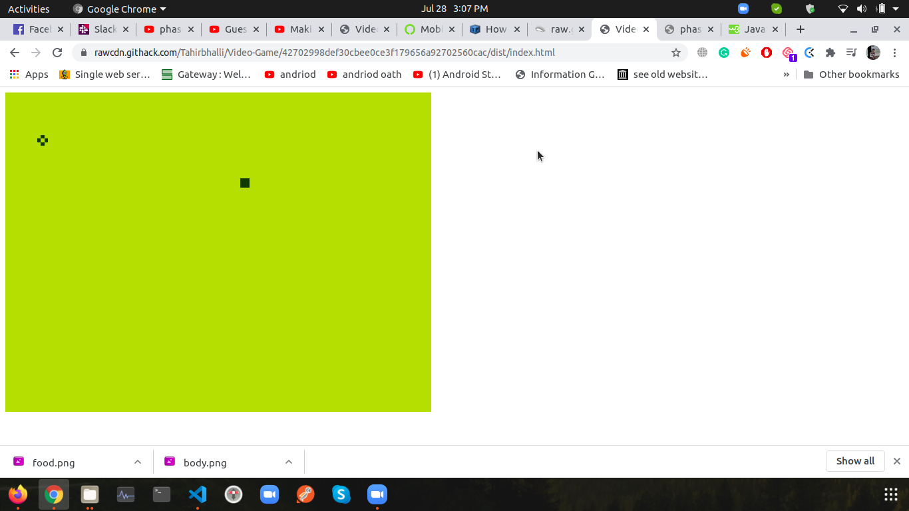

# Video-Game

This is Snake game. The Game consists a leaderboard where the other players score shown as well,You can set the speed of the snale and then start the game.
## Built With

- Html
- Phaser
- Javascript
- webpack

## How to Run
- npm install --save-dev
- npm run dev
- http://localhost/8080

## Live Demo

[Live Demo Link](https://rawcdn.githack.com/Tahirbhalli/Video-Game/c5bafb09d799173ec98abdbb6b550cb406cc044e/dist/index.html)

## Presentation
[Presentation Link](https://www.loom.com/share/b4be3c8e42b44255bfffb1057a65cb00)

## Authors

👤 **Tahir Ahmad**

- Github: [@tahirbhalli](https://github.com/tahirbhalli/)
- Twitter: [@tahirbhalli](https://twitter.com/tahirbhalli)
- Linkedin: [Tahir Ahmad](https://www.linkedin.com/in/tahirahmad16/)

## 🤝 Contributing

Contributions, issues and feature requests are welcome! Start by:
* Forking the project
* Cloning the project to your local machine
* `cd` into the Youtube-Replica project directory
* Run `git checkout -b your-branch-name`
* Make your contributions
* Push your branch up to your forked repository
* Open a Pull Request with a detailed description to the development branch of the original project for a review

## 📝 License

This project is [MIT](https://opensource.org/licenses/MIT) licensed.